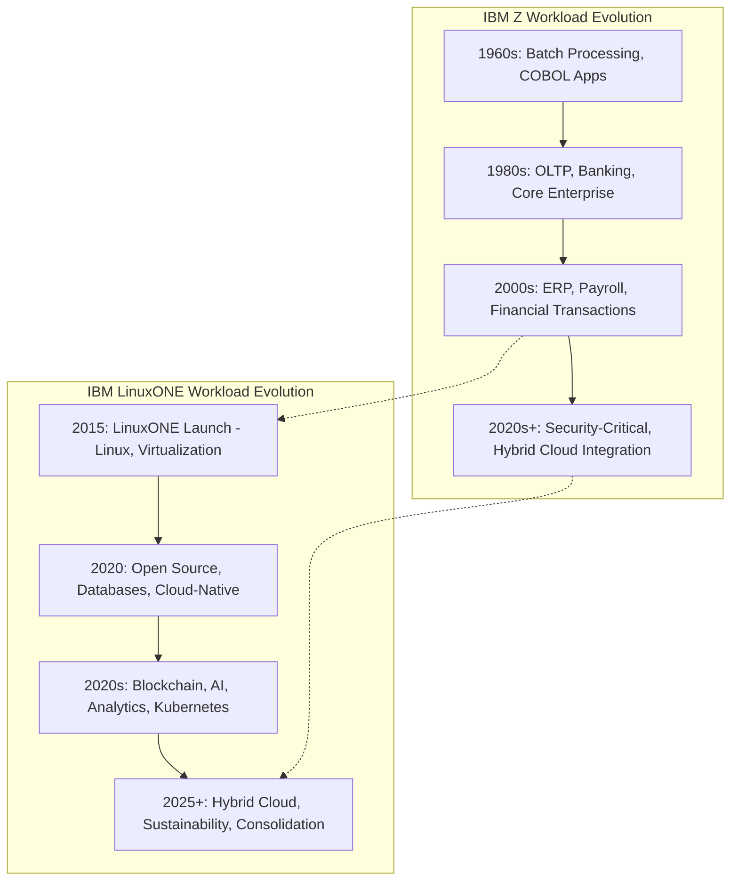

# Chapter 4: IBM Z vs IBM LinuxONE – Use Cases and Target Workloads

IBM Z and IBM LinuxONE share a common hardware foundation, but they are optimized for **different workloads and enterprise requirements**. Understanding the unique strengths of each platform helps organizations deploy the right system for their business needs.

---

## 4.1 IBM Z: Target Workloads and Use Cases

IBM Z is the flagship mainframe platform, known for handling **mission-critical workloads** that demand maximum reliability, throughput, and security.

### 4.1.1 Transaction Processing
- High-volume OLTP (Online Transaction Processing).
- Banking, insurance, and retail systems handling millions of daily transactions.
- Example: Processing credit card authorizations in real time.

### 4.1.2 Core Enterprise Applications
- Running COBOL, PL/I, and Java-based enterprise applications.
- Traditional workloads like ERP, payroll, and large-scale batch processing.

### 4.1.3 Industry-Specific Workloads
- **Banking and Finance:** Real-time settlement, fraud detection, compliance reporting.
- **Government:** Tax systems, benefits processing, census data management.
- **Telecom:** Billing and subscriber management.

### 4.1.4 Security-Critical Applications
- Applications requiring pervasive encryption.
- Workloads involving sensitive personal or financial data.

---

## 4.2 IBM LinuxONE: Target Workloads and Use Cases

LinuxONE is tailored for **Linux, open-source, and cloud-native workloads**. It is the platform of choice for enterprises looking to modernize with **open ecosystems** while retaining mainframe-grade reliability.

### 4.2.1 Cloud-Native Applications
- Kubernetes and Docker container orchestration at scale.
- Running modern microservices architectures.
- Example: Hosting fintech platforms and SaaS applications.

### 4.2.2 Blockchain and Digital Assets
- Optimized for Hyperledger Fabric and other blockchain frameworks.
- Provides security, scalability, and performance for digital asset ecosystems.

### 4.2.3 AI and Analytics
- On-chip AI acceleration for real-time inference.
- Running big data frameworks (Apache Spark, Hadoop).
- Use cases: fraud detection, personalized recommendations, IoT analytics.

### 4.2.4 Open Source Workloads
- PostgreSQL, MongoDB, MariaDB, and other enterprise databases.
- DevOps and CI/CD pipelines using Jenkins, Ansible, and GitOps.

### 4.2.5 Sustainable Consolidation
- Replace hundreds of x86 servers with one LinuxONE machine.
- Reduce power, cooling, and data center footprint.

---

## 4.3 Key Differences in Workload Orientation

| Feature/Workload       | IBM Z                                | IBM LinuxONE                           |
|------------------------|--------------------------------------|----------------------------------------|
| **Primary Focus**      | Transaction processing & enterprise apps | Cloud-native, Linux, open-source apps  |
| **Typical Users**      | Banks, governments, telecoms         | Fintechs, SaaS providers, digital-native firms |
| **OS Support**         | z/OS, z/VM, z/VSE, Linux on Z        | Linux only                             |
| **Best For**           | Legacy + modern mission-critical apps | Open-source modernization + consolidation |
| **Workload Examples**  | Banking transactions, ERP, batch jobs | Blockchain, AI/ML, container workloads |

---

## 4.4 Complementary Roles

Although IBM Z and LinuxONE are distinct, they often **complement each other** in enterprise IT:

- **IBM Z:** Runs traditional core banking systems and critical transaction platforms.  
- **IBM LinuxONE:** Hosts modern, open-source apps, analytics, and APIs that extend mainframe data to digital platforms.  
- Together, they enable **hybrid cloud integration** and **digital transformation** without sacrificing security or reliability.  

---

## 4.5 Summary

- **IBM Z** excels in **traditional, mission-critical workloads** that require ultra-high reliability, transaction throughput, and secure processing.  
- **IBM LinuxONE** is designed for **modern, Linux-based, and open-source workloads**, with strengths in scalability, cloud-native apps, and blockchain.  
- Enterprises often use both platforms together to achieve **resilient, future-ready hybrid IT infrastructures**.

---

## 4.6 Workload Comparison Diagram

## 4.7 Hybrid Timeline: IBM Z vs LinuxONE Workload Evolution

The diagram below illustrates how **IBM Z** workloads (traditional, mission-critical) and **IBM LinuxONE** workloads (modern, open-source, cloud-native) evolved in parallel, diverging in focus but converging in hybrid enterprise use.

---

✅ This hybrid diagram shows:  
- **IBM Z (top track):** Progressing from batch → OLTP → ERP → hybrid security workloads.  
- **IBM LinuxONE (bottom track):** Starting in 2015 → open source/cloud-native → blockchain/AI → hybrid sustainability.  
- **Dashed arrows** show where LinuxONE diverged from IBM Z and how they **reconnect in hybrid cloud**.  