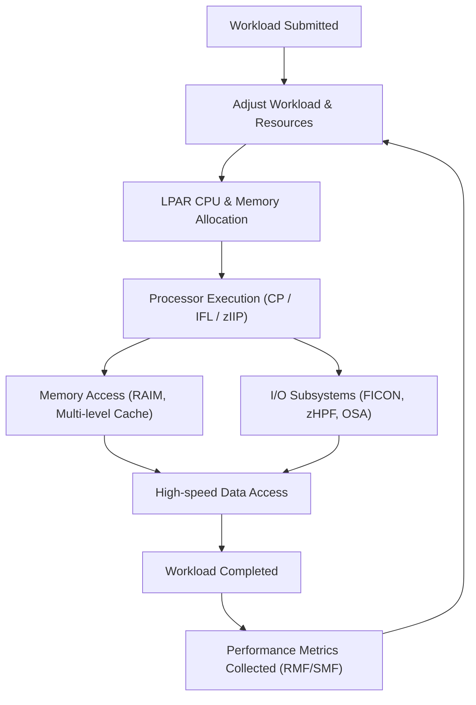

# Chapter 10: Performance Optimization on IBM Z / LinuxONE

IBM Z and LinuxONE systems provide **high-performance computing** for mission-critical workloads. Optimizing performance involves understanding the architecture, workloads, and tuning various system components.

## 10.1 Key Performance Goals

- **Maximize CPU Utilization:** Ensure processors are efficiently used.  
- **Minimize Latency:** Optimize memory, cache, and I/O access.  
- **Balance Workloads:** Distribute tasks across LPARs and virtual machines.  
- **Ensure Scalability:** Handle increasing workloads without performance degradation.

## 10.2 CPU and Workload Optimization

1. **Processor Selection**
   - Use **IFLs** for Linux workloads to reduce software licensing costs.  
   - Offload specialized workloads to **zIIPs or zAAPs**.  

2. **Simultaneous Multithreading (SMT)**
   - Increase parallelism by running multiple threads per physical core.  
   - Monitor CPU usage to avoid over-committing threads.

3. **Workload Manager (WLM)**
   - Dynamically distributes workloads across LPARs and systems.  
   - Assigns **service classes** and performance goals to prioritize important workloads.

## 10.3 Memory and Cache Tuning

- **Multi-Level Cache Optimization**
  - L1, L2, L3, and optional L4 caches reduce memory access latency.  
  - Monitor cache hit ratios and adjust workloads to leverage cache efficiently.

- **RAIM Memory**
  - Provides redundancy without impacting performance.  
  - Ensure workloads are optimized to benefit from memory interleaving.

## 10.4 I/O Performance

1. **Channel and Adapter Optimization**
   - Use **FICON/zHPF channels** for storage-intensive workloads.  
   - **OSA adapters** for high-speed Ethernet networking.  

2. **Parallel I/O**
   - Spread I/O across multiple paths and channels to avoid bottlenecks.  

3. **Storage Access Optimization**
   - Leverage **page-level caching and buffer tuning** in databases and applications.

## 10.5 Virtualization and LPAR Tuning

- **Logical Partitions (LPARs)**
  - Assign CPU, memory, and I/O resources according to workload priority.  

- **Dynamic Resource Allocation**
  - Use **Capacity on Demand (CoD)** to scale resources in real-time.  

- **Virtual Machine Tuning**
  - Optimize Linux VMs or containers for CPU affinity and NUMA locality.

## 10.6 Monitoring and Analysis Tools

1. **RMF (Resource Measurement Facility)**
   - Provides performance data on CPU, memory, I/O, and LPAR usage.  

2. **SMF (System Management Facility)**
   - Collects detailed system and workload statistics for analysis.  

3. **z/OS and LinuxONE Tools**
   - **Topas, nmon, and vmstat** for real-time monitoring.  
   - Use logs and metrics to identify hotspots and optimize configuration.

## 10.7 Best Practices for Performance

- Minimize lock contention in parallel workloads.  
- Avoid over-committing virtual CPUs or threads.  
- Use **hardware-assisted encryption** (Crypto Express) to reduce CPU overhead.  
- Spread I/O workloads across multiple channels to avoid bottlenecks.  
- Regularly analyze performance metrics and tune resources dynamically.  

## 10.8 Performance Optimization Flow

**Explanation:**
 - Workloads are assigned priorities and service classes.
 - CPU, memory, and I/O resources are dynamically allocated.
 - Performance metrics guide further optimization to maintain throughput and minimize latency.

## 10.9 Summary

 - IBM Z and LinuxONE provide powerful tools for workload optimization.
 - Key areas include CPU, memory, I/O, virtualization, and workload management.
 - Monitoring and analysis are essential for continuous tuning. 
 - Proper resource allocation, cache optimization, and workload distribution ensure maximum performance for mission-critical enterprise workloads.