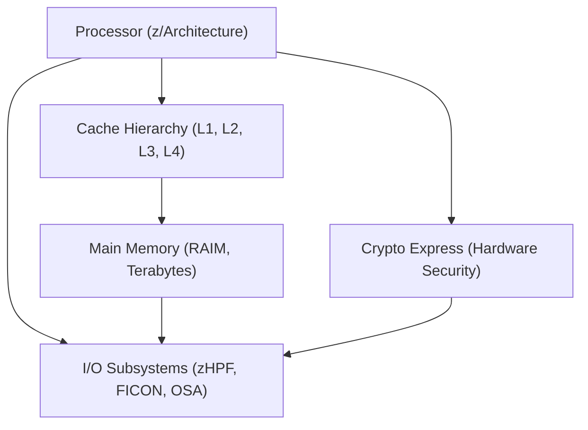
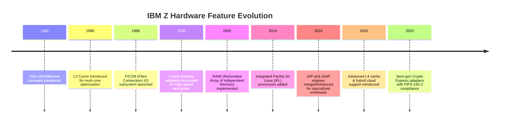

# Chapter 6: IBM Z Hardware Architecture

IBM Z systems are built on decades of engineering focused on **scalability, performance, and reliability**. Their hardware architecture combines powerful processors, advanced memory systems, and specialized accelerators that set them apart from commodity servers.  

This chapter provides an overview of the major components that define the **IBM Z hardware platform**.

## 6.1 Processor Architecture (z/Architecture)

- **64-bit Instruction Set:** Introduced with z/Architecture, enabling extremely large address spaces (up to 16 exabytes of virtual memory).  
- **High Core Count:** IBM Z processors (CPs) are optimized for high-throughput transaction processing.  
- **Simultaneous Multithreading (SMT):** Each core supports multiple hardware threads, improving utilization for workloads like databases and transaction processing.  
- **Specialty Engines:**  
  - **zIIP (z Integrated Information Processor):** Offloads specific workloads (e.g., DB2 queries, XML parsing).  
  - **zAAP (z Application Assist Processor, now merged with zIIP):** Used for Java workloads.  
  - **IFL (Integrated Facility for Linux):** Dedicated for Linux workloads on IBM Z and LinuxONE.  

**Key Advantage:** Optimized for **mixed workloads**, allowing both traditional mainframe apps and modern Linux environments to run simultaneously.

## 6.2 Cache Hierarchy and Memory Subsystems

IBM Z is designed to minimize **latency bottlenecks** with a multi-level cache and memory structure:

- **L1, L2, L3 Caches:** Each processor core has private L1/L2 caches, with a large shared L3 cache for high-speed data access.  
- **L4 Cache (Optional):** Implemented in system controllers, reducing cross-chip latency.  
- **RAIM (Redundant Array of Independent Memory):** Provides memory fault tolerance similar to RAID for disks, ensuring **99.999% uptime**.  
- **Memory Scaling:** Systems support terabytes of main memory, allowing massive in-memory databases and analytics.  

**Key Advantage:** Ensures **consistent low latency** and resiliency for transaction-heavy workloads.

## 6.3 Crypto Express Cards

IBM Z leads in **enterprise-grade cryptography** with dedicated hardware accelerators:

- **Crypto Express Adapter:** A PCIe-based coprocessor that provides high-speed cryptographic operations.  
- **Supported Functions:**  
  - Symmetric and asymmetric encryption (AES, RSA, ECC).  
  - Secure key management and digital signatures.  
  - Hardware-secured random number generation.  
- **Compliance:** Certified to meet **FIPS 140-2 and 140-3** standards.  
- **Secure Execution Environment:** Keys are never exposed in software, ensuring **end-to-end encryption**.  

**Use Cases:**  
- Financial transactions (banks, payment processors).  
- Secure digital identity verification.  
- Regulatory compliance (GDPR, PCI DSS, HIPAA).  

---

## 6.4 I/O Subsystems (zHPF, FICON, OSA)

IBM Z systems excel at handling **massive I/O throughput**:

- **zHPF (z High Performance FICON):**  
  - Reduces I/O overhead with channel command word (CCW) optimization.  
  - Improves efficiency for disk-intensive workloads.  

- **FICON (Fibre Connection):**  
  - High-speed optical channel protocol for storage systems.  
  - Provides low-latency access to mainframe-attached storage arrays.  

- **OSA (Open Systems Adapter):**  
  - Networking interface for TCP/IP and SNA traffic.  
  - Enables integration with enterprise Ethernet networks.  
  - Supports virtual networking for **partitioned environments (LPARs, z/VM, KVM)**.  

**Key Advantage:** IBM Z can handle **hundreds of thousands of I/O operations per second**, ensuring performance for high-volume transaction workloads.  

---

## 6.5 Summary

The **IBM Z hardware architecture** is designed for **resiliency, performance, and security at scale**:  

- **Processors (z/Architecture):** Specialized for mixed workloads with high throughput.  
- **Cache and Memory:** Redundant, multi-level caches and fault-tolerant memory subsystems.  
- **Crypto Express:** Dedicated secure cryptographic coprocessors for compliance and trust.  
- **I/O Subsystems:** Advanced storage and networking technologies (zHPF, FICON, OSA) ensure massive throughput.  

Together, these components enable IBM Z to power **mission-critical enterprise workloads**—from financial systems to hybrid cloud integration—while meeting modern demands for **security, efficiency, and scale**.  

---

## 6.6 Architecture Overview Diagram

## 6.7 IBM Z Hardware Evolution Timeline

