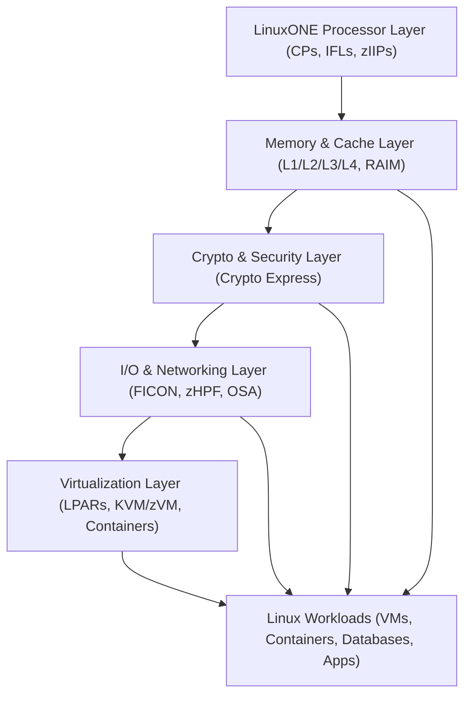
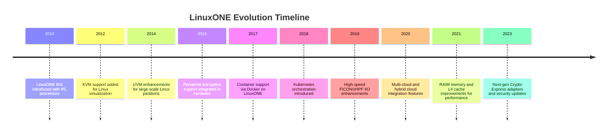

# Chapter 7: LinuxONE Architecture Overview

LinuxONE is IBM’s mainframe platform optimized for **Linux workloads**, offering enterprise-grade **performance, scalability, and security**. It combines the reliability of IBM Z hardware with the flexibility of Linux, making it ideal for cloud-native, hybrid cloud, and mission-critical applications.

---

## 7.1 LinuxONE Design Goals

- **Enterprise Scalability:** Supports thousands of virtual machines and containers simultaneously.  
- **High Availability:** Features IBM Z hardware resiliency, including RAIM memory, hot-swappable components, and self-healing infrastructure.  
- **Security & Compliance:** Pervasive encryption and secure key management to meet regulatory requirements.  
- **Hybrid Cloud Integration:** Seamlessly runs traditional and modern workloads side by side.

---

## 7.2 System Architecture Overview

LinuxONE architecture integrates **processor, memory, storage, networking, and specialized engines** to deliver high performance for Linux workloads:

### 7.2.1 Processor Layer

- Uses **z/Architecture processors** (CPs, IFLs, zIIPs) optimized for Linux workloads.  
- **IFL (Integrated Facility for Linux)** cores dedicated for Linux workloads, reducing licensing costs.  
- Supports **simultaneous multithreading (SMT)** for maximum CPU utilization.  

### 7.2.2 Memory & Cache Layer

- Multi-level caches (L1, L2, L3, optional L4) minimize latency.  
- **RAIM memory** ensures fault tolerance and continuous operation.  
- Memory is shared efficiently across Linux virtual machines and containers.

### 7.2.3 Crypto & Security Layer

- **Crypto Express adapters** provide hardware-based encryption.  
- Supports **pervasive encryption** across workloads, storage, and network traffic.  
- Compliant with **FIPS 140-3** and other enterprise-grade security standards.

### 7.2.4 I/O & Networking Layer

- High-speed **FICON and zHPF** for storage connectivity.  
- **Open Systems Adapters (OSA)** for Ethernet networking.  
- Supports **virtualized networking** across multiple Linux VMs and partitions.  

### 7.2.5 Virtualization & Partitioning

- LinuxONE uses **LPARs (Logical Partitions)** and **KVM/z/VM** to isolate workloads.  
- Enables **cloud-like elasticity** with hundreds of VMs or containers per system.  
- Simplifies **resource allocation** while maintaining high performance and reliability.

---

## 7.3 Key Features

- **Elastic Capacity on Demand:** Dynamically adjust CPU and memory resources.  
- **Enterprise Kubernetes Support:** Run containerized workloads efficiently.  
- **Hybrid Workload Management:** Mix traditional Linux workloads with cloud-native applications.  
- **High I/O Throughput:** Ideal for databases, financial transactions, and analytics.  

---

## 7.4 Architecture Diagram

## 7.5 Summary

LinuxONE merges mainframe resiliency with Linux flexibility:
 - Dedicated IFL processors reduce licensing costs.
 - Multi-layer memory and cache deliver low-latency performance.
 - Crypto Express adapters provide pervasive encryption.
 - I/O and networking layers handle massive workloads with minimal latency.
 - Virtualization allows hundreds of Linux VMs and containers to coexist securely and efficiently.

LinuxONE is ideal for enterprise Linux workloads, cloud-native applications, and organizations requiring high security, availability, and scalability.

## 7.6 LinuxONE Hardware & Virtualization Evolution Timeline

