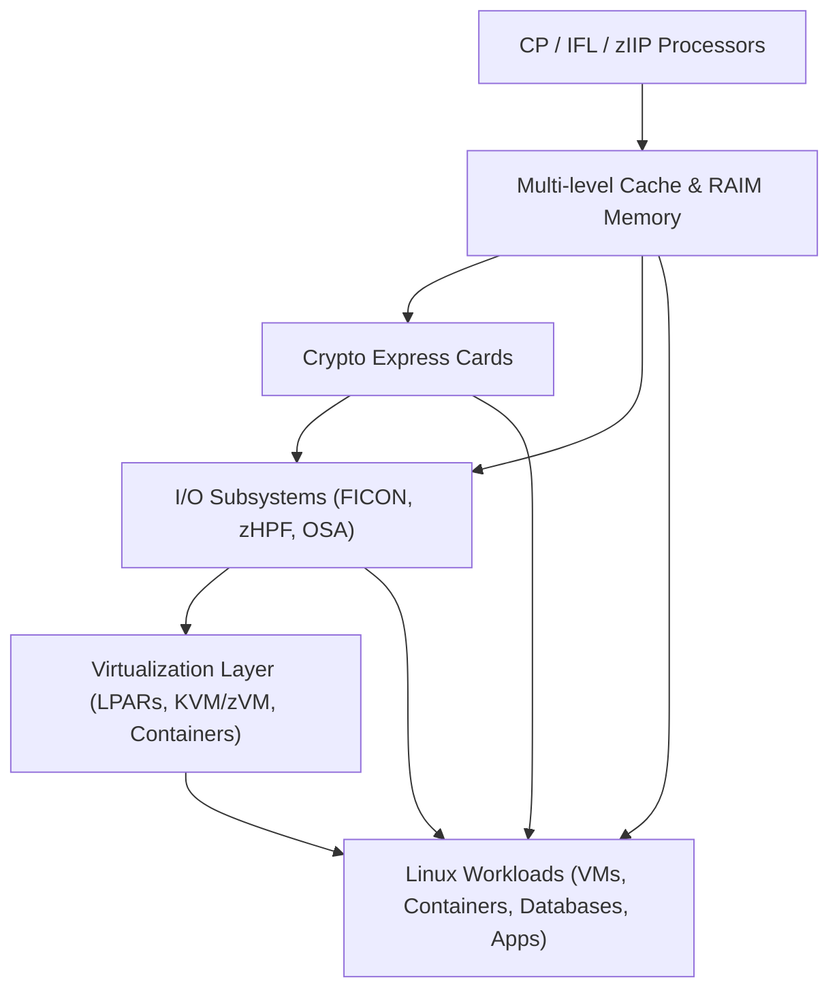

# Chapter 8: System Components and Interconnects

LinuxONE and IBM Z mainframes rely on a **highly integrated system architecture** that ensures **performance, scalability, and reliability**. Understanding the key components and interconnects is critical for deploying enterprise workloads efficiently.

---

## 8.1 Processor and Core Components

- **Central Processors (CPs):** Execute general-purpose workloads.  
- **Integrated Facility for Linux (IFLs):** Dedicated cores for Linux workloads, reducing software licensing costs.  
- **zIIPs and zAAPs:** Specialized engines for offloading specific workloads such as DB2 and Java processing.  
- **Simultaneous Multithreading (SMT):** Enables multiple threads per physical core to maximize CPU utilization.

---

## 8.2 Memory Subsystems

- **RAIM Memory (Redundant Array of Independent Memory):** Protects against memory failures and ensures continuous operation.  
- **Multi-level Cache:** L1, L2, L3, and optional L4 caches reduce latency and improve throughput.  
- **Memory Channels:** High-speed interconnects to processors for rapid data access.

---

## 8.3 I/O Subsystems

- **FICON (Fibre Connection):** High-speed channel for mainframe storage devices.  
- **zHPF (High Performance FICON):** Enhanced FICON with improved bandwidth and latency.  
- **OSA (Open Systems Adapter):** Provides Ethernet connectivity for LinuxONE and IBM Z workloads.  
- **CAPI / OpenCAPI:** Accelerator interfaces for connecting specialized hardware like FPGAs.

---

## 8.4 Crypto Express Cards

- Hardware-based encryption engines integrated into the system.  
- Supports **pervasive encryption** for data at rest, in memory, and in transit.  
- Offloads cryptographic operations from main processors, enhancing performance.  

---

## 8.5 Interconnects and Communication

- **High-speed System Bus:** Connects processors, memory, and I/O channels with low latency.  
- **Coupling Facility (CF):** Enables multi-system clustering and shared data caching for parallel processing.  
- **PCIe and OpenCAPI Links:** Interface external accelerators and specialized hardware.  
- **Virtualized Interconnects:** Allows LPARs and virtual machines to communicate efficiently without impacting physical resources.

---

## 8.6 System Components Diagram

## 8.7 Summary

IBM Z and LinuxONE systems are built with tightly integrated components to optimize performance and reliability.

 - Processor cores are specialized to handle Linux, Java, and database workloads efficiently.
 - Memory and cache subsystems provide high-speed data access and fault tolerance.
 - I/O and networking components offer high throughput and low latency.
 - Crypto engines provide pervasive encryption without impacting workload performance.

Virtualized interconnects enable hundreds of VMs or containers to communicate efficiently, ensuring scalability in modern enterprise environments.