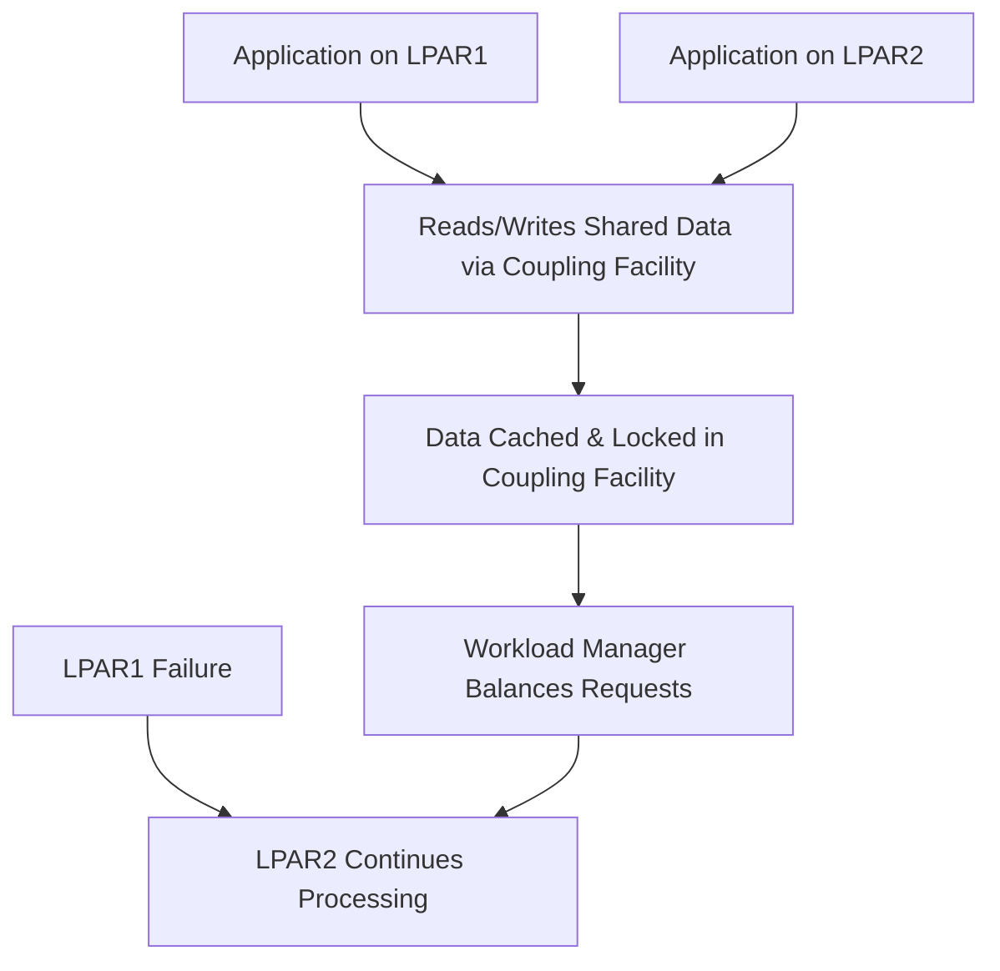

# Chapter 9: Parallel Sysplex and High Availability

IBM Z and LinuxONE systems provide **enterprise-grade availability** through **Parallel Sysplex**, clustering technologies, and redundant infrastructure. This chapter explains how high availability is achieved in modern mainframes.

## 9.1 What is Parallel Sysplex

- **Parallel Sysplex** is IBM’s clustering technology for mainframes, enabling multiple systems to work together as a single logical unit.  
- Provides **scalability, workload balancing, and high availability**.  
- Key components:
  - **Coupling Facility (CF):** Shared memory and lock management for coordination between systems.  
  - **Sysplex Timer:** Provides a common time reference for all systems.  
  - **Shared Workload Manager (WLM):** Distributes workloads across LPARs and systems.

## 9.2 Key Features

1. **Workload Distribution**
   - Dynamically balances tasks across multiple systems.  
   - Ensures no single system is overloaded.  

2. **Data Sharing**
   - Allows multiple instances of applications or databases to access the same data.  
   - Reduces duplication and improves consistency.

3. **High Availability**
   - Redundant systems automatically take over in case of hardware or software failure.  
   - Minimal downtime for mission-critical applications.

4. **Scalability**
   - New systems can be added to the Sysplex without major reconfiguration.  
   - Supports hundreds of LPARs and thousands of virtual machines.

## 9.3 Coupling Facility (CF)

- Central to Parallel Sysplex.  
- Provides **lock management, caching, and list structures** shared across multiple systems.  
- Ensures data consistency across the cluster.  
- High-speed interconnects and redundancy reduce latency and prevent single points of failure.

## 9.4 High Availability Techniques

1. **RAIM Memory**
   - Redundant memory protects against hardware faults.  

2. **Redundant I/O Paths**
   - Multiple channels and adapters prevent single points of failure in storage and network connections.  

3. **Logical Partitions (LPARs)**
   - Isolate workloads so that failures in one partition do not affect others.  

4. **Clustered Applications**
   - Applications like Db2, CICS, and WebSphere can run across multiple systems for failover capability.  

5. **Pervasive Encryption**
   - Protects data at rest and in motion without compromising high availability.  

## 9.5 Example: High Availability Flow

***Explanation:***
 - Multiple LPARs access shared data through the Coupling Facility.
 - Workload Manager ensures balanced request handling.
In case of failure, other LPARs continue processing without downtime.

## 9.6 Summary
 - Parallel Sysplex enables clustering for scalability, high availability, and workload sharing.
 - Coupling Facility ensures data consistency and high-speed interconnects.
 - Mainframe redundancy mechanisms, RAIM memory, and clustered applications provide mission-critical reliability.
 - LinuxONE benefits from these high-availability features while running modern Linux workloads in virtualized environments.