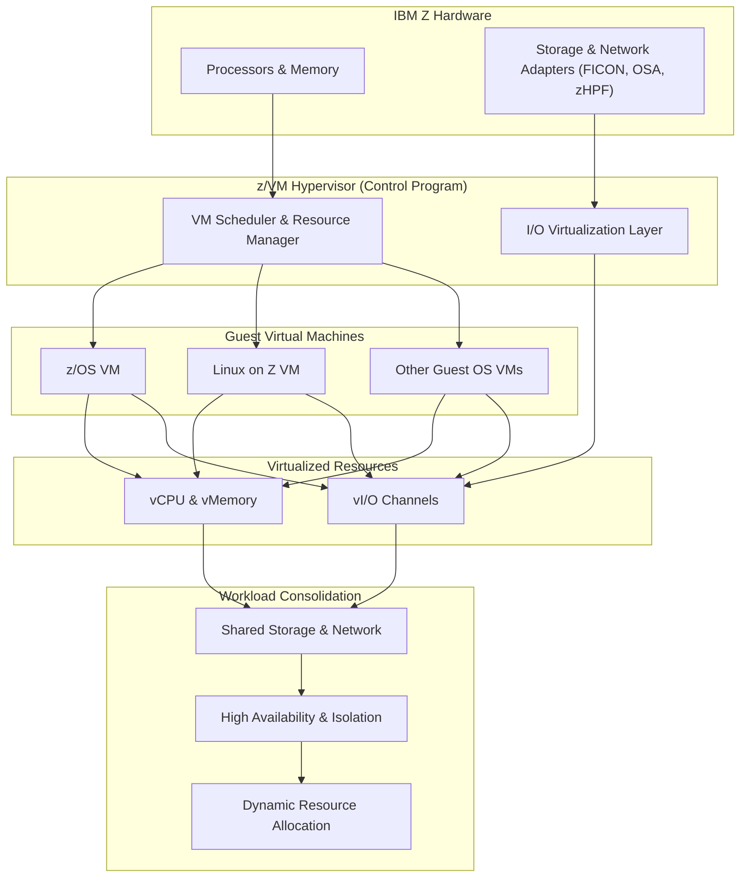

# Chapter 13: Integration with z/VM

z/VM is IBM Z’s **hypervisor** that provides virtualization capabilities, enabling multiple virtual machines (VMs) to run concurrently on a single mainframe. Integration with z/VM allows z/OS, Linux, and other workloads to **coexist securely and efficiently**.

## 13.1 Introduction to z/VM

- **Type-1 hypervisor** running directly on IBM Z hardware.  
- Supports **virtualization of CPU, memory, storage, and networking**.  
- Optimized for **large-scale virtualization**, enabling hundreds or thousands of virtual machines.

**Key Benefits:**

- Efficient resource utilization across multiple workloads.  
- Isolation and security between virtual machines.  
- Dynamic allocation of CPU and memory resources.

## 13.2 Virtual Machine Architecture

1. **Control Program (CP)**
   - Core component of z/VM that manages VM scheduling, memory, and I/O.  

2. **Guest Virtual Machines**
   - Can run z/OS, Linux on Z, or other supported operating systems.  
   - Each VM has **virtualized CPU, memory, and devices**.

3. **Hypervisor Services**
   - Resource sharing and allocation.  
   - I/O virtualization via **virtual channels and virtual networking**.

## 13.3 z/OS Integration with z/VM

1. **z/OS as a Guest**
   - Runs in a virtual machine under z/VM.  
   - Uses virtualized CPUs, memory, and I/O channels.  

2. **Workload Consolidation**
   - Multiple z/OS instances can run on a single physical machine.  
   - Reduces hardware footprint while maintaining isolation.

3. **Dynamic Resource Management**
   - z/VM dynamically allocates CPU and memory based on workload demand.  
   - Supports **capacity planning and scaling** without downtime.

## 13.4 Linux on z/VM

- Linux virtual machines run efficiently alongside z/OS instances.  
- Enables **hybrid environments** combining Linux applications with mainframe services.  
- Supports **high-density VM deployments** for cloud-native and container workloads.

## 13.5 Device and I/O Virtualization

1. **Virtual Channels**
   - Virtualized paths to access storage and network devices.  
   - Allows multiple VMs to share physical hardware without conflicts.

2. **Shared Memory and Messaging**
   - High-speed communication between VMs using virtual memory or virtual I/O.  

3. **Network Virtualization**
   - Virtual networks allow secure and isolated communication among VMs.  
   - Integration with **FICON, OSA, and zHPF adapters**.

---

## 13.6 Advantages of Integration

- **Consolidation:** Run multiple OSes and workloads on one mainframe.  
- **Isolation:** Each VM is protected from others, enhancing security.  
- **Dynamic Allocation:** CPU, memory, and I/O resources can be adjusted on the fly.  
- **High Availability:** VMs can be migrated or restarted without impacting other workloads.  
- **Cost Efficiency:** Reduces hardware needs while maximizing utilization.

---

## 13.7 Summary

- z/VM provides robust **virtualization for IBM Z hardware**.  
- Integration with z/OS and Linux allows **hybrid, high-density, mission-critical workloads**.  
- Virtualized CPU, memory, and I/O ensure **efficient resource use and isolation**.  
- Dynamic management and consolidation reduce **costs** while maintaining **performance, availability, and security**.

#### Hardware resources are virtualized for multiple VMs while maintaining performance, isolation, and flexibility:

***Highlights of this diagram:***
 - Top layer: IBM Z hardware (CPU, memory, storage, network).
 - Second layer: z/VM hypervisor with VM scheduler and I/O virtualization.
 - Third layer: Guest VMs (z/OS, Linux, other OSes).
 - Fourth layer: Virtualized resources (vCPU, vMemory, vI/O channels).
 - Bottom layer: Workload consolidation, shared storage/network, high availability, and dynamic resource allocation.

