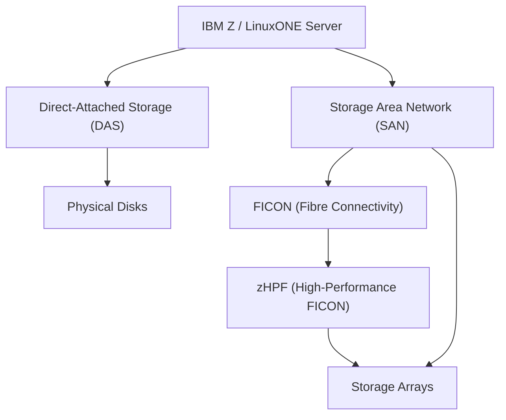
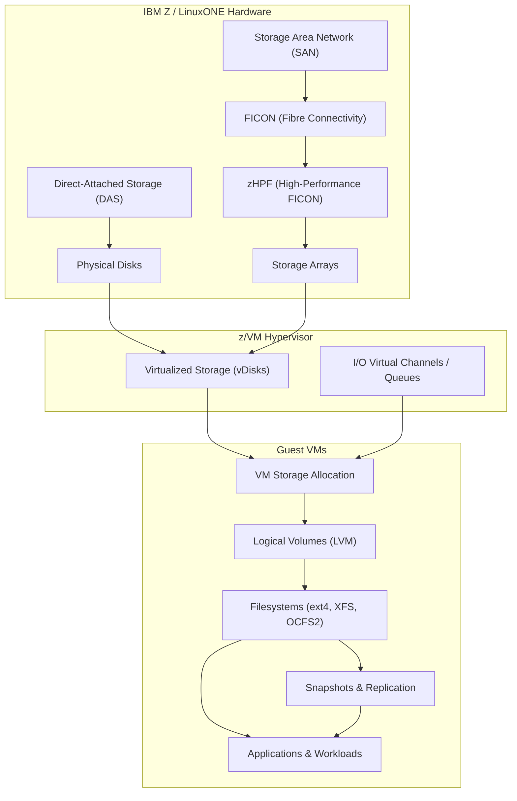

# Chapter 14: Storage Management in LinuxONE

LinuxONE provides high-performance, secure, and scalable storage solutions designed for enterprise workloads. Proper storage management ensures data integrity, availability, and optimal performance across z/VM, Linux, and z/OS workloads.

## 14.1 Storage Architecture Overview

- **Direct-Attached Storage (DAS):** Physical disks directly connected to IBM Z hardware.
- **SAN (Storage Area Network):** High-speed network connecting storage arrays to LinuxONE servers.
- **FICON (Fibre Connectivity):** High-speed mainframe I/O protocol for connecting storage devices.
- **zHPF (High-Performance FICON):** Optimized channel for faster mainframe storage access.

**Key Features:**

- Enterprise-grade redundancy and fault tolerance.
- Scalable for large transactional and database workloads.
- Supports high-throughput and low-latency I/O operations.

## 14.2 Logical Volumes and Filesystems

- **LVM (Logical Volume Manager):**
  - Abstracts physical storage into logical volumes.
  - Allows dynamic resizing and snapshotting of volumes.
  - Supports mirroring for high availability.

- **Filesystems:**
  - **ext4**: General-purpose filesystem with journaling support.
  - **XFS**: High-performance filesystem for large files and high concurrency.
  - **OCFS2 / GFS2**: Clustered filesystems for shared storage among multiple VMs.

**Use Cases:**

- Databases requiring dynamic storage allocation.
- Applications needing consistent performance under high I/O load.
- Shared storage across clustered workloads.

## 14.3 Device Virtualization

- **Virtualized Storage in z/VM:**
  - Virtual disks (vDisks) assigned to guest VMs.
  - Each VM perceives a dedicated storage device.
- **Dynamic Allocation:**
  - z/VM can reassign storage dynamically without downtime.
  - Enables workload consolidation and efficient resource utilization.

- **I/O Channels and Queues:**
  - Multiple virtual I/O channels ensure parallel access.
  - Reduces bottlenecks in high-throughput workloads.

## 14.4 Storage Management Tools

1. **z/VM DASD Management:**
   - Allocate, map, and monitor virtual disks.
   - Supports multiple RAID configurations for redundancy.

2. **Linux Volume Management:**
   - `lvm` commands for creating, resizing, and managing volumes.
   - Snapshot and thin provisioning for testing and backup.

3. **Monitoring Tools:**
   - `iostat`, `vmstat`, and `sar` for I/O performance monitoring.
   - Enterprise monitoring with IBM Z storage management software.

## 14.5 High Availability and Disaster Recovery

- **RAID and Mirroring:**
  - Protects against disk failures.
  - Ensures continuous availability for mission-critical applications.

- **Replication and Snapshots:**
  - Off-site replication for disaster recovery.
  - Snapshots for point-in-time backups.

- **Integration with Parallel Sysplex:**
  - Multiple LinuxONE systems share storage for HA and load balancing.

## 14.6 Best Practices

- Plan storage tiers based on workload performance requirements.
- Use logical volumes and snapshots to enable flexible management.
- Monitor I/O performance regularly to identify bottlenecks.
- Leverage virtualization to maximize storage utilization and consolidation.
- Integrate backup and replication strategies for high availability and disaster recovery.

## 14.7 Summary

LinuxONE storage management provides:

- High-performance, scalable storage architecture.
- Virtualized storage for guest VMs with dynamic allocation.
- Logical volume management and advanced filesystems.
- Tools for monitoring, replication, and disaster recovery.
- Seamless integration with z/VM and Parallel Sysplex for high availability.

Proper storage management ensures that enterprise workloads on LinuxONE remain **secure, available, and performant**.

### Diagram shows the complete storage architecture for LinuxONE from physical storage to applications with virtualization and HA mechanisms**

**Highlights:**
- Hardware Layer: DAS and SAN as storage sources. FICON and zHPF are high-speed mainframe protocols connecting SAN to storage arrays.

 - Hypervisor Layer: z/VM virtualizes storage into vDisks and manages I/O channels.

 - Guest VM Layer: VMs allocate storage from vDisks, create logical volumes, format filesystems, and run workloads.
 - Snapshots & Replication: Ensure high availability, backup, and disaster recovery.

