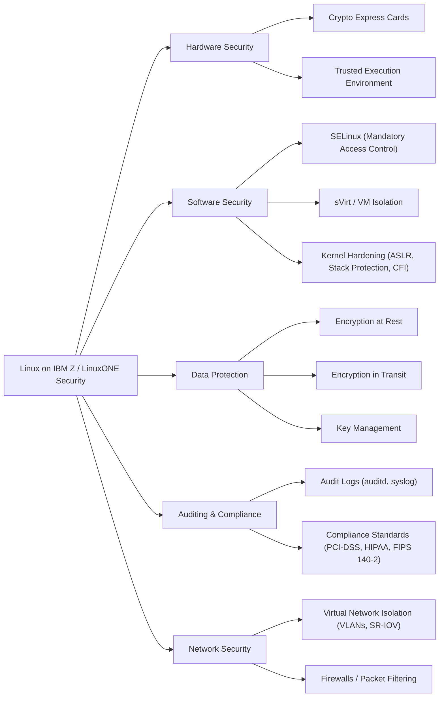

# Chapter 15: Security Features in Linux on IBM Z / LinuxONE

Linux on IBM Z and LinuxONE provides a **highly secure enterprise environment**, combining hardware-based security with software-level protections. These features ensure data confidentiality, integrity, and compliance for critical workloads.

## 15.1 Hardware-Based Security

### 15.1.1 Crypto Express Cards
- Dedicated cryptographic hardware for **encryption, decryption, and hashing**.
- Supports:
  - AES, RSA, ECC encryption
  - Hashing algorithms (SHA, SHA-2)
  - Secure key management
- **Use Cases:** Securing data at rest and in transit, database encryption, SSL/TLS offload.

### 15.1.2 Trusted Execution Environment
- Secure execution of sensitive workloads.
- Protects against tampering or unauthorized memory access.
- Supports **confidential computing** for multi-tenant environments.

## 15.2 Software Security Features

### 15.2.1 SELinux (Security-Enhanced Linux)
- Mandatory access control (MAC) framework.
- Enforces security policies on processes, files, and resources.
- **Use Cases:** Limit process access to critical files, enforce strict permissions in multi-user environments.

### 15.2.2 sVirt / Virtual Machine Isolation
- Leverages **SELinux and virtualization** for VM isolation.
- Each virtual machine has its own security domain.
- Prevents accidental or malicious cross-VM access.

### 15.2.3 Kernel Hardening
- Hardened Linux kernel on Z includes:
  - Address Space Layout Randomization (ASLR)
  - Stack protection
  - Control Flow Integrity (CFI)
- Protects against **buffer overflows, code injection, and other exploits**.

## 15.3 Data Protection Mechanisms

### 15.3.1 Encryption at Rest
- Data stored on DAS or SAN can be encrypted using Crypto Express or zHPF channels.
- Provides **transparent encryption** for applications and databases.

### 15.3.2 Encryption in Transit
- TLS/SSL connections are offloaded to hardware for high performance.
- Ensures secure communication between servers and clients.

### 15.3.3 Key Management
- **Centralized key management system** integrates with Crypto Express.
- Supports **secure key generation, rotation, and storage**.

## 15.4 Auditing and Compliance

- **Auditd / Syslog** for logging security events.
- Integration with enterprise SIEM systems.
- Compliance with standards such as:
  - PCI-DSS
  - HIPAA
  - FIPS 140-2
- Provides **traceability and accountability** for sensitive workloads.

## 15.5 Network Security

- Virtual network isolation via **VLANs and SR-IOV**.
- Firewalls and packet filtering (iptables/nftables).
- Secure multi-tenant network segregation in z/VM environments.

## 15.6 Best Practices

1. Enable SELinux and configure strict policies.
2. Use Crypto Express for sensitive data encryption.
3. Regularly audit logs and monitor security events.
4. Isolate workloads using sVirt or dedicated VMs.
5. Implement centralized key management and rotate keys periodically.
6. Apply kernel and software security patches promptly.

## 15.7 Summary

Linux on IBM Z / LinuxONE combines **hardware security, kernel hardening, virtualization isolation, and strong cryptographic capabilities**. Together, these mechanisms provide:

- Protection against unauthorized access.
- Secure data at rest and in transit.
- Compliance with enterprise security standards.
- Isolation and secure management of multi-tenant workloads.

By following best practices, organizations can leverage LinuxONE to run **highly secure, mission-critical workloads** with confidence.

**Explanation:**

 - Hardware Security: Crypto Express Cards handle encryption; Trusted Execution Environment protects sensitive workloads.

 - Software Security: SELinux enforces access control, sVirt ensures VM isolation, and kernel hardening protects against exploits.

 - Data Protection: Encryption and centralized key management ensure secure storage and transmission of data.

 - Auditing & Compliance: Logs and adherence to enterprise standards provide traceability.

 - Network Security: Virtual isolation and firewalls prevent unauthorized access across workloads.