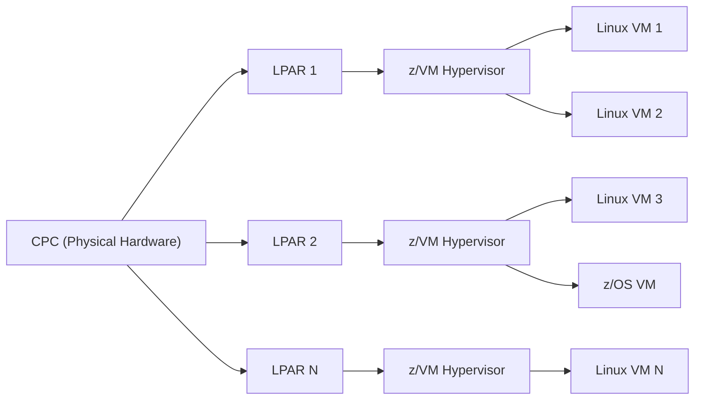

# Chapter 16: IBM Z Virtualization Technology

IBM Z and LinuxONE are designed for highly **virtualized, multi-tenant enterprise environments**. Virtualization allows organizations to consolidate workloads, improve resource utilization, and isolate applications securely.

---

## 16.1 z/VM Basics

- **z/VM** is IBM's hypervisor for IBM Z systems.
- Provides **full virtualization** for mainframes, allowing multiple virtual machines (VMs) to run concurrently.
- Each VM can run **Linux, z/OS, or other supported OSes**.
- Features include:
  - **Workload isolation:** Each VM has its own resources and OS instance.
  - **Dynamic resource allocation:** CPU, memory, and I/O can be allocated or reallocated on the fly.
  - **High availability:** z/VM supports live migration and failover for critical workloads.

**Use Cases:**
- Consolidating hundreds of Linux workloads on a single IBM Z system.
- Multi-tenant cloud environments with secure isolation.
- Running mixed OS environments concurrently.

---

## 16.2 LPARs (Logical Partitions) and CPCs (Central Processor Complexes)

### 16.2.1 LPARs
- LPARs divide a single physical IBM Z system into multiple **isolated logical systems**.
- Each LPAR has:
  - Dedicated CPU, memory, and I/O resources.
  - Independent OS instance (Linux, z/OS, z/VM).
- **Benefits:**
  - Resource isolation for security and performance.
  - Flexible allocation and scaling of resources.
  - Simplifies testing and staging environments.

### 16.2.2 CPCs
- The **Central Processor Complex (CPC)** is the physical hardware that hosts LPARs.
- CPC components:
  - Physical CPUs
  - Memory
  - I/O adapters
  - Channel subsystem for high-speed I/O
- CPC provides the foundation for LPARs and z/VM to function efficiently.

---

## 16.3 Relationship between z/VM, LPARs, and CPCs

- **CPC** = physical mainframe hardware.
- **LPAR** = logical partition of a CPC.
- **z/VM** runs inside an LPAR and can host multiple virtual machines.
- **Linux and z/OS** VMs run on top of z/VM for workload consolidation and isolation.

##16.4 Benefits of IBM Z Virtualization

- Workload Consolidation: Run hundreds of VMs on a single physical system.

- Resource Efficiency: Dynamic allocation of CPU, memory, and I/O.

- Isolation and Security: Each VM or LPAR is isolated, reducing risk of interference.

- High Availability: z/VM supports live migration, redundancy, and failover.

- Flexibility: Mix of OSes and applications on the same hardware.

## 16.5 Summary

IBM Z virtualization technology combines LPARs, CPCs, and z/VM to provide:

- Efficient use of physical resources.

- Isolation and security for workloads.

- Flexibility to run mixed OS and multi-tenant environments.

- Enterprise-grade high availability and scalability.

Virtualization is a cornerstone feature of IBM Z and LinuxONE, enabling modern enterprise IT to consolidate, secure, and scale critical workloads effectively.