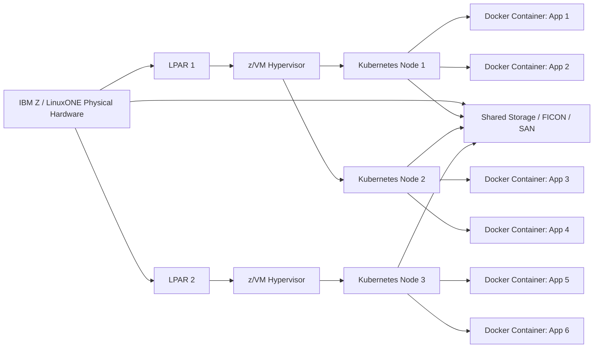
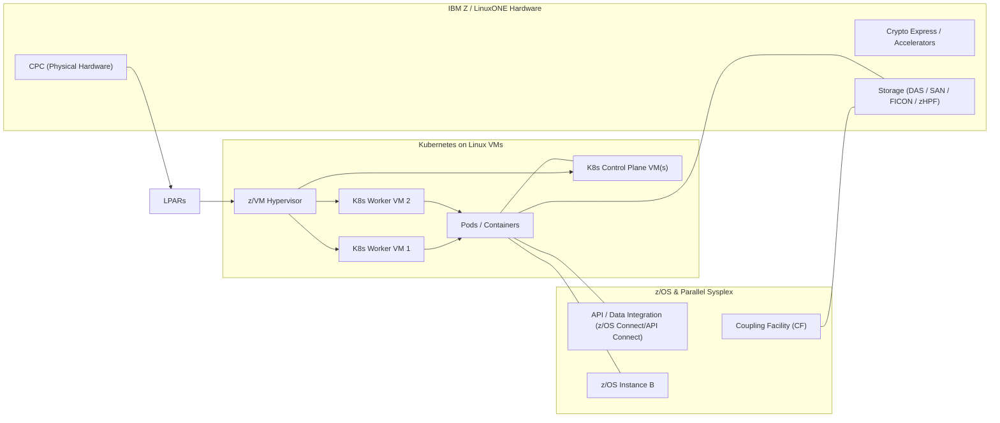

# Chapter 17: Docker and Kubernetes on IBM Z

IBM Z and LinuxONE support modern **containerization and orchestration technologies**, enabling enterprises to run cloud-native workloads alongside traditional mainframe applications.


## 17.1 Docker on IBM Z

- **Docker** provides lightweight containers for packaging applications and dependencies.
- Containers on IBM Z run **Linux for Z** distributions, fully optimized for s390x architecture.
- Features:
  - Same container paradigms as x86 Linux.
  - Access to mainframe resources like Crypto Express, z/VM, and LPARs.
  - High reliability and security inherent in IBM Z systems.

**Use Cases:**
- Packaging mainframe-compatible applications for quick deployment.
- Running microservices and legacy workloads in isolated containers.
- Testing and staging environments without affecting production systems.

**Example:**

```text
# Pull an s390x-compatible Docker image
docker pull ibmcom/ubuntu:18.04-s390x

# Run a container
docker run -it ibmcom/ubuntu:18.04-s390x /bin/bash
```
## 17.2 Kubernetes on IBM Z

Kubernetes provides orchestration for containers, enabling scaling, load balancing, and automated deployment.

IBM Z supports Kubernetes clusters running on LinuxONE and z Systems.

**Features:**

- Multi-architecture support (s390x)
- Integrates with mainframe networking and storage
- Supports CI/CD pipelines for enterprise applications

**Use Cases:**

- Orchestrating hundreds of containerized applications
- High availability and fault-tolerant deployments
- Hybrid workloads: mainframe and cloud-native containers side by side

**Example Architecture:**

- **Nodes:** IBM Z LPARs or LinuxONE VMs hosting container runtimes
- **Pods:** Docker containers running services
- **Persistent Volumes:** z/VM storage or SAN attached storage


## 17.3 Benefits of Containers on IBM Z

- **Isolation:** Containers are lightweight yet isolated for security
- **Efficiency:** Multiple workloads share the same OS kernel without overhead of full VMs
- **Portability:** s390x-compatible containers can run on any LinuxONE or IBM Z system
- **Integration:** Containers can access hardware features like cryptography, I/O channels, and secure memory
- **Scalability:** Kubernetes automates deployment, scaling, and health management


## 17.4 Example: Kubernetes Deployment on LinuxONE

```bash
# Create a namespace
kubectl create namespace mainframe-apps

# Deploy a container
kubectl apply -f deployment.yaml

# Check pods
kubectl get pods -n mainframe-apps
```

- Containers run on **s390x nodes**
- Kubernetes manages scaling, networking, and updates automatically
- Can coexist with traditional workloads on the same LPAR or z/VM instance

## 17.5 Summary

- IBM Z and LinuxONE bring **cloud-native capabilities** to mainframe workloads
- Docker and Kubernetes allow enterprises to run **microservices, CI/CD pipelines, and hybrid applications** efficiently
- Containers and orchestration combine mainframe **reliability, scalability, and security** with modern software development practices
- Enables coexistence of **legacy and cloud-native applications** on the same hardware

**Diagram showing how Docker containers and Kubernetes orchestrate workloads on IBM Z / LinuxONE, including LPARs, z/VM, and mainframe hardware:**
## Diagram Explanation

- **IBM Z / LinuxONE Physical Hardware:** The foundation (CPU, memory, I/O, Crypto Express)
- **LPARs:** Divide physical hardware into isolated logical systems
- **z/VM:** Runs inside LPARs to host multiple virtual machines
- **Kubernetes Nodes:** Run on Linux VMs provided by z/VM
- **Docker Containers (Pods):** Run inside Kubernetes nodes
- **Shared Storage / FICON / SAN:** Accessible by containers for persistent volumes





## Reference Architecture (high level)


