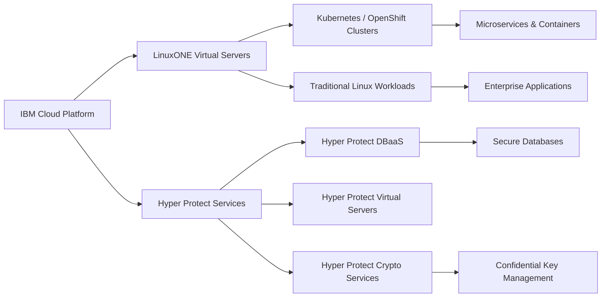

# Chapter 18: IBM Cloud and LinuxONE

IBM Cloud and **LinuxONE** together provide a platform that combines the scalability, security, and reliability of mainframes with the agility of cloud-native technologies. This integration enables enterprises to run traditional workloads alongside **cloud-native applications** without compromising performance or compliance.

## 18.1 IBM Cloud Overview

IBM Cloud is IBM’s enterprise-grade cloud platform that offers:

- **Infrastructure as a Service (IaaS):** Bare metal, virtual servers, and networking.  
- **Platform as a Service (PaaS):** Managed databases, AI, and middleware services.  
- **Software as a Service (SaaS):** Business applications and APIs.  
- **Hybrid Cloud:** Seamless integration of on-premises mainframes with IBM Cloud.  

With **LinuxONE**, IBM Cloud extends these capabilities to mainframe environments, ensuring mission-critical reliability.

## 18.2 LinuxONE on IBM Cloud

IBM LinuxONE can be consumed via IBM Cloud in different models:

1. **LinuxONE Virtual Servers on IBM Cloud**
   - On-demand provisioning of LinuxONE virtual servers.  
   - Secure and cost-efficient for workloads requiring **compliance** (e.g., finance, healthcare).  

2. **Hyper Protect Services**
   - Built on LinuxONE and IBM Z hardware with **confidential computing**.  
   - Includes:
     - **Hyper Protect Virtual Servers**: Isolated workloads with hardware-based encryption.  
     - **Hyper Protect DBaaS**: Securely managed databases.  
     - **Hyper Protect Crypto Services**: Cloud HSMs backed by Crypto Express cards.  

3. **Cloud-Native Enablement**
   - Support for **Kubernetes, OpenShift, and Docker** on LinuxONE in IBM Cloud.  
   - Enables running **CI/CD pipelines**, containerized workloads, and microservices.  

## 18.3 Benefits of LinuxONE in IBM Cloud

- **Security & Compliance:** End-to-end encryption, tamper protection, and auditability.  
- **Elastic Scalability:** Dynamic scaling of workloads without downtime.  
- **High Availability:** Fault tolerance across zones and regions.  
- **Hybrid Flexibility:** Ability to run workloads across **on-premises mainframes and IBM Cloud**.  
- **Cost Efficiency:** Pay-as-you-go models reduce CapEx.  

## 18.4 Example Use Cases

- **Financial Services:** Secure digital banking with regulatory compliance.  
- **Healthcare:** Protecting patient data with HIPAA-ready solutions.  
- **Government & Public Sector:** Confidential computing and citizen data security.  
- **Blockchain:** Secure and scalable infrastructure for distributed ledgers.  
- **DevOps Pipelines:** Running CI/CD for mainframe and cloud-native applications side by side.  

---

## 18.5 IBM Cloud + LinuxONE Architecture (Example)

## 18.6 Summary

IBM Cloud and LinuxONE together deliver a secure, scalable, and hybrid-ready platform that bridges mainframe resilience with modern cloud innovation.

- Enterprises can modernize applications without leaving mission-critical workloads behind.

- Developers benefit from cloud-native tools like Kubernetes and CI/CD pipelines.

- Organizations gain unmatched security, particularly with Hyper Protect Services.

This combination makes LinuxONE in IBM Cloud a powerful choice for enterprises pursuing digital transformation with trust and reliability.

## 18.7 LinuxONE On-Premises vs IBM Cloud Deployment

| Feature/Aspect               | LinuxONE On-Premises                 | LinuxONE on IBM Cloud                    |
|-------------------------------|-------------------------------------|----------------------------------------|
| **Deployment Model**          | Physical mainframe hardware in enterprise data center | Virtualized LinuxONE servers in IBM Cloud |
| **Control & Customization**   | Full control over hardware, networking, storage | Limited to IBM Cloud configurations, managed services |
| **Security**                  | Hardware-based encryption, in-house key management | Hyper Protect Services with cloud HSM and encryption |
| **Scalability**               | Scale by adding physical hardware | Elastic scaling on-demand via cloud provisioning |
| **Maintenance**               | Managed by enterprise IT staff | IBM Cloud handles infrastructure maintenance |
| **Cost Model**                | CapEx-heavy, upfront investment    | Pay-as-you-go, OpEx model              |
| **High Availability**         | Enterprise-managed HA with Sysplex and redundant hardware | Built-in HA across cloud regions, automated failover |
| **Use Cases**                 | Legacy mainframe applications, mission-critical workloads | Cloud-native workloads, hybrid applications, rapid provisioning |
| **Integration**               | Direct integration with on-premise systems | Hybrid integration with on-prem, cloud services, and APIs |
| **Developer Experience**      | Standard mainframe tools, may require specialized skillsets | Modern DevOps tools: Kubernetes, Docker, CI/CD pipelines |

**Key Takeaways:**

- On-premises LinuxONE provides **maximum control and integration** for enterprises with legacy mainframe workloads.  
- IBM Cloud LinuxONE offers **elasticity, faster provisioning, and cloud-native toolsets** while maintaining mainframe-grade security.  
- Hybrid strategies allow organizations to **run sensitive workloads on-prem** and **cloud-native workloads in IBM Cloud**, achieving the best of both worlds.  
