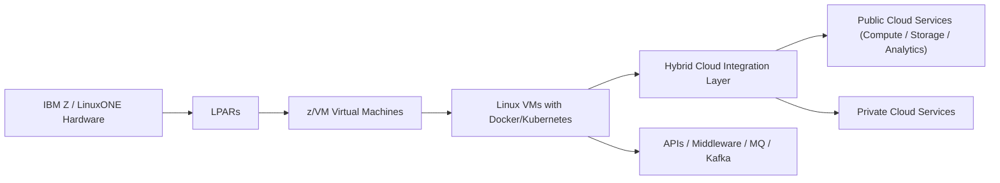

# Chapter 20: Hybrid Cloud Integration

Hybrid cloud integration on IBM Z and LinuxONE enables enterprises to combine the reliability, security, and performance of mainframe systems with the flexibility and scalability of public and private cloud environments. This chapter explores architectures, strategies, and tools for integrating mainframe workloads with hybrid cloud solutions.

## 20.1 Introduction to Hybrid Cloud

**Definition:** A hybrid cloud combines on-premises infrastructure (IBM Z / LinuxONE) with public cloud services, allowing data and applications to move seamlessly between environments.

**Benefits:**
- Flexibility to run workloads in the most appropriate environment.
- Cost optimization by offloading non-critical workloads to public cloud.
- High availability and disaster recovery through multi-site deployment.
- Improved agility for application development and deployment.

## 20.2 Integration Strategies

### 20.2.1 API-Based Integration

**Description:** Exposing mainframe services (z/OS or LinuxONE) via APIs allows cloud applications to access critical business functions.

**Tools:**
- **z/OS Connect** — RESTful APIs for z/OS applications.
- **IBM API Connect** — API management platform for secure exposure and monitoring.
- **MQ / Kafka** — Messaging middleware to bridge workloads.

**Use Cases:**
- Cloud-native apps invoking mainframe business logic.
- Event-driven architectures integrating legacy and cloud services.

### 20.2.2 Data Synchronization

**Mechanisms:**
- Real-time replication between DB2 on z/OS and cloud databases.
- Batch ETL pipelines using IBM DataStage or Apache NiFi.
- Object storage integration for unstructured data (S3, IBM Cloud Object Storage).

**Benefits:**
- Ensures consistency between mainframe and cloud systems.
- Enables hybrid analytics and reporting.
- Supports disaster recovery and offsite backups.

### 20.2.3 Workload Offloading

**Description:** Move suitable workloads to cloud platforms while keeping critical, sensitive, or latency-sensitive workloads on IBM Z.

**Examples:**
- Running web front-ends or mobile app backends in the cloud.
- Containerized microservices on LinuxONE accessing mainframe APIs.
- Batch processing or testing workloads in a public cloud sandbox.

## 20.3 Hybrid Cloud Architecture on IBM Z / LinuxONE

**Layers:**
1. **Physical Layer:** IBM Z / LinuxONE hardware with LPARs and z/VM.
2. **Virtualization Layer:** z/VM hosts Linux VMs.
3. **Container Layer:** Docker and Kubernetes orchestrate cloud-native workloads.
4. **Integration Layer:** APIs, middleware, messaging.
5. **Cloud Layer:** Public/private cloud services for compute, storage, analytics.

**Example Use Case Diagram (Mermaid):**

## 20.4 Security and Compliance

- Enforce end-to-end encryption (TLS) for data in transit.  
- Utilize Crypto Express and hardware security modules (HSM) for sensitive data.  
- Role-based access control (RBAC) for hybrid cloud APIs.  
- Ensure compliance with regulatory standards (GDPR, PCI DSS) across cloud and mainframe.  

## 20.5 Best Practices

- Identify workloads suitable for cloud offloading.  
- Use API-first design to expose mainframe services.  
- Implement real-time or near-real-time data replication for critical data.  
- Secure hybrid connections with VPNs, encryption, and identity management.  
- Monitor performance and availability across both mainframe and cloud environments.  
- Automate deployment and scaling using Kubernetes and CI/CD pipelines.  

## 20.6 Summary

- Hybrid cloud enables mainframes to coexist with cloud-native applications.  
- Integration layers like APIs, middleware, and messaging bridge the gap between IBM Z / LinuxONE and cloud services.  
- Proper security, compliance, and workload selection are critical to achieving the benefits of hybrid cloud.  
- IBM Z and LinuxONE provide a robust, secure, and scalable foundation for enterprise hybrid cloud strategies.

