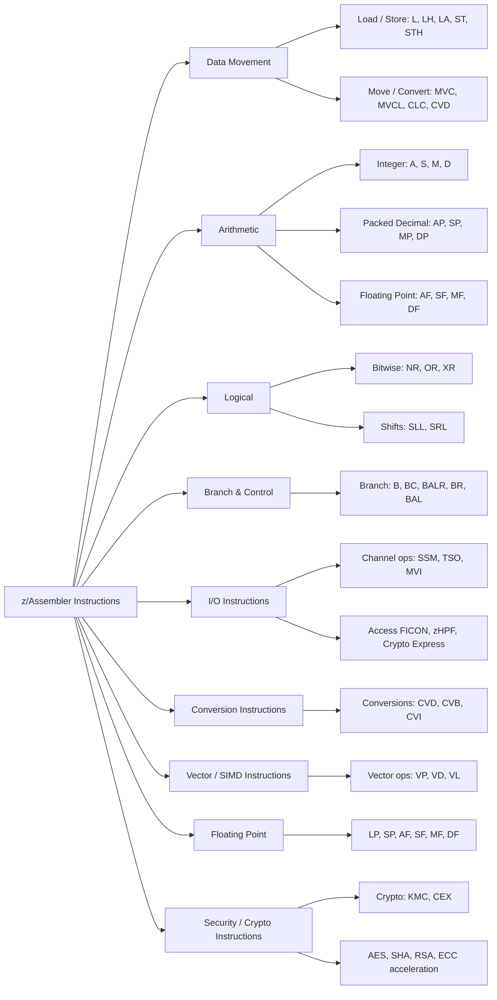

# Chapter 22: Exploring z/Architecture and z/Assembler Instructions

The **z/Architecture** is IBM Z’s 64-bit instruction set architecture (ISA) that underpins all IBM Z and LinuxONE systems. It is designed for **high reliability, availability, scalability, and security**, making it ideal for enterprise-class workloads. Alongside the architecture, **z/Assembler** provides a rich instruction set for developers to directly leverage IBM Z hardware capabilities.

---

## 22.1 Overview of z/Architecture

- **64-bit General Purpose Architecture:** Can address extremely large memory spaces (up to exabytes).
- **Backward Compatibility:** Supports legacy 24-bit and 31-bit applications.
- **Designed for Mainframe Reliability:** Includes features for error detection, correction, and transactional integrity.
- **Symmetric Multiprocessing (SMP):** Multi-core capable, supports simultaneous multi-threading (SMT).

---

## 22.2 Key Features of z/Architecture

### 22.2.1 General Purpose Registers (GPRs)
- 16 GPRs (64-bit) for arithmetic, logic, and address computations.
- Enables high-speed data manipulation.
- Can be paired with floating-point or vector instructions.

### 22.2.2 Floating Point and Decimal Facilities
- **Floating Point:** For scientific and technical computations.
- **Decimal Floating Point:** Native support for exact decimal arithmetic.
- Useful in banking, finance, and insurance workloads.

### 22.2.3 Vector Facility
- Single Instruction Multiple Data (SIMD) capability.
- Processes multiple data elements simultaneously.
- Accelerates cryptography, compression, and analytics operations.

### 22.2.4 High-Throughput I/O Instructions
- Efficient access to **FICON**, **zHPF**, **DAS**, and **Crypto Express** devices.
- Reduces CPU cycles for I/O-intensive applications.

### 22.2.5 Storage Management
- Supports huge pages and large virtual address spaces.
- Hardware-assisted paging, TLBs, and memory protection keys.
- Enables high-performance, large-scale memory operations.

### 22.2.6 Reliability, Availability, Serviceability (RAS)
- Hardware error detection and correction (ECC).
- CPU recovery, redundant components, and automatic failover.
- Continuous availability with minimal downtime.

### 22.2.7 Security Features
- Integrated cryptographic instructions for AES, SHA, RSA, ECC.
- Support for tamper-resistant hardware modules.
- Secure key storage and accelerated cryptographic operations.

### 22.2.8 Parallel Sysplex Integration
- Hardware and ISA support for **Coupling Facility**.
- Enables high-speed communication and workload sharing between multiple systems.
- Provides disaster recovery, high availability, and data sharing.

---

## 22.3 z/Architecture Modes

1. **z/Architecture Mode (64-bit)**
   - Full 64-bit addressing.
   - Supports modern applications with large memory requirements.

2. **31-bit Mode**
   - Backward compatibility for older 32-bit applications.
   - Preserves existing software investments.

3. **24-bit Mode**
   - Legacy mode for very old mainframe applications.

# Chapter 22: Exploring z/Architecture

The **z/Architecture** is IBM Z’s 64-bit instruction set architecture (ISA) that underpins all IBM Z and LinuxONE systems. It is designed for **high reliability, availability, scalability, and security**, making it ideal for enterprise-class workloads.

---

## 22.1 Overview of z/Architecture

- **64-bit General Purpose Architecture:** Can address extremely large memory spaces (up to exabytes).
- **Backward Compatibility:** Supports legacy 24-bit and 31-bit applications.
- **Designed for Mainframe Reliability:** Includes features for error detection, correction, and transactional integrity.
- **Symmetric Multiprocessing (SMP):** Multi-core capable, supports simultaneous multi-threading (SMT).

---

## 22.2 Key Features of z/Architecture

### 22.2.1 General Purpose Registers (GPRs)
- 16 GPRs (64-bit) for arithmetic, logic, and address computations.
- Enables high-speed data manipulation.
- Can be paired with floating-point or vector instructions.

### 22.2.2 Floating Point and Decimal Facilities
- **Floating Point:** For scientific and technical computations.
- **Decimal Floating Point:** Native support for exact decimal arithmetic.
- Useful in banking, finance, and insurance workloads.

### 22.2.3 Vector Facility
- Single Instruction Multiple Data (SIMD) capability.
- Processes multiple data elements simultaneously.
- Accelerates cryptography, compression, and analytics operations.

### 22.2.4 High-Throughput I/O Instructions
- Efficient access to **FICON**, **zHPF**, **DAS**, and **Crypto Express** devices.
- Reduces CPU cycles for I/O-intensive applications.

### 22.2.5 Storage Management
- Supports huge pages and large virtual address spaces.
- Hardware-assisted paging, TLBs, and memory protection keys.
- Enables high-performance, large-scale memory operations.

### 22.2.6 Reliability, Availability, Serviceability (RAS)
- Hardware error detection and correction (ECC).
- CPU recovery, redundant components, and automatic failover.
- Continuous availability with minimal downtime.

### 22.2.7 Security Features
- Integrated cryptographic instructions for AES, SHA, RSA, ECC.
- Support for tamper-resistant hardware modules.
- Secure key storage and accelerated cryptographic operations.

### 22.2.8 Parallel Sysplex Integration
- Hardware and ISA support for **Coupling Facility**.
- Enables high-speed communication and workload sharing between multiple systems.
- Provides disaster recovery, high availability, and data sharing.

---

## 22.3 z/Architecture Modes

1. **z/Architecture Mode (64-bit)**
   - Full 64-bit addressing.
   - Supports modern applications with large memory requirements.

2. **31-bit Mode**
   - Backward compatibility for older 32-bit applications.
   - Preserves existing software investments.

3. **24-bit Mode**
   - Legacy mode for very old mainframe applications.

---

### 22.3.1 Principle of Operations

IBM Z architecture operates on the following principles:

1. **Vector and SIMD Operations**
   - Parallel processing of multiple data elements for cryptography, analytics, and compression.

2. **Registers**
   - 16 GPRs and floating-point/vector registers for high-speed computation.

3. **Large Memory and Caching**
   - 64-bit addressing, multi-level caches, and TLBs for low-latency access.

4. **High-Throughput I/O**
   - FICON, zHPF, and DMA reduce CPU load and improve I/O performance.

5. **Instruction Pipeline**
   - Fetch → Decode → Operand Access → Execution → Result Storage → Update Flags → Next Instruction.

6. **Microcode Management**
   - Ensures instruction compatibility and optimized execution across generations.

7. **Simultaneous Multi-Threading (SMT)**
   - Hardware-level parallelism across CPU cores.

8. **Hardware Cryptography**
   - Crypto Express adapters accelerate encryption/decryption and secure transactions.

9. **Parallel Sysplex Support**
   - High-speed coupling for workload sharing and disaster recovery.

10. **Reliability, Availability, Serviceability (RAS)**
    - ECC, redundant components, and automatic failover minimize downtime.

**Summary:** IBM Z principles of operation ensure that compute, memory, and I/O are tightly integrated, delivering high performance, scalability, and reliability for enterprise workloads.

---

### 22.3.2 Optimization Strategies for z/Architecture

- Use **64-bit addressing** for large datasets.
- Leverage **vector and SIMD instructions** for performance-critical loops.
- Exploit **hardware cryptography** for secure transactions.
- Use **memory protection keys** to isolate and secure workloads.
- Profile applications with **IBM Z Performance Tools** for bottleneck identification.

## 22.4 z/Assembler Instructions

z/Assembler provides direct access to IBM Z hardware capabilities. Instructions are grouped into categories:

### 22.4.1 Data Movement
- Load / Store: `L`, `LH`, `LA`, `ST`, `STH`
- Move / Convert: `MVC`, `MVCL`, `CLC`, `CVD`

### 22.4.2 Arithmetic
- Integer: `A`, `S`, `M`, `D`
- Packed Decimal: `AP`, `SP`, `MP`, `DP`
- Floating Point: `AF`, `SF`, `MF`, `DF`

### 22.4.3 Logical
- Bitwise operations: `NR`, `OR`, `XR`
- Shifts: `SLL`, `SRL`

### 22.4.4 Branch and Control
- Branch: `B`, `BC`, `BALR`, `BR`, `BAL`

### 22.4.5 I/O Instructions
- Channel operations: `SSM`, `TSO`, `MVI`
- Efficient access to FICON, zHPF, Crypto Express

### 22.4.6 Conversion Instructions
- `CVD`, `CVB`, `CVI`

### 22.4.7 Vector Facility (SIMD)
- Vector arithmetic/logical: `VP`, `VD`, `VL`

### 22.4.8 Security / Crypto Instructions
- Key management: `KMC`, `CEX`
- Hardware-assisted AES, SHA, RSA, ECC operations

---

## 22.5 Addressing Modes

- Immediate: Operand in instruction
- Register: Use general-purpose registers
- Base-Displacement: Base register + displacement
- Indexed: Base + index
- Relative: PC-relative addressing (for branching)

---

## 22.6 Optimization Strategies

- Use **64-bit addressing** for large datasets.
- Leverage **vector and SIMD instructions** for performance-critical loops.
- Exploit **hardware cryptography** for secure transactions.
- Use **memory protection keys** to isolate workloads.
- Profile applications with **IBM Z Performance Tools** for bottleneck identification.

---

## 22.7 Use Cases

- **Financial Services:** High-speed transaction processing, fraud detection.
- **Enterprise Databases:** DB2, IMS, and large-scale transactional systems.
- **Hybrid Cloud & DevOps:** Containerized applications and Kubernetes orchestration.
- **Analytics and AI:** Real-time processing on large datasets.
- **Security-Critical Applications:** Cryptography-heavy workloads and payment processing.

---

## 22.8 Summary

z/Architecture provides a **robust, high-performance, secure, and scalable foundation** for enterprise workloads. Combined with **z/Assembler instructions**, developers can write **highly optimized, low-level programs** that leverage hardware acceleration, SIMD/vector operations, and high-throughput I/O for IBM Z and LinuxONE systems.

## 22.9 z/Assembler Instruction Categories Diagram

```mermaid
flowchart LR
    A["z/Assembler Instructions"] --> B["Load/Store Operations"]
    A --> C["Move/Convert Instructions"]
    A --> D["Integer Arithmetic"]
    A --> E["Packed Decimal Arithmetic"]
    A --> F["Binary Floating Point Arithmetic"]
    A --> G["Logical Instructions"]
    A --> H["Branch & Control Instructions"]
    A --> I["I/O Instructions"]
    A --> J["Conversion Instructions"]
    A --> K["Vector Facility (SIMD)"]
    A --> L["Floating Point Instructions"]
    A --> M["Security / Crypto Instructions"]

    B --> B1["L – Load fullword"]
    B --> B2["LH – Load halfword"]
    B --> B3["LA – Load address"]
    B --> B4["ST – Store fullword"]
    B --> B5["STH – Store halfword"]

    C --> C1["MVC – Move characters"]
    C --> C2["MVCL – Move long strings"]
    C --> C3["CLC – Compare logical characters"]
    C --> C4["CVD – Convert numeric decimal"]

    D --> D1["A – Add"]
    D --> D2["S – Subtract"]
    D --> D3["M – Multiply"]
    D --> D4["D – Divide"]

    E --> E1["AP – Add packed decimal"]
    E --> E2["SP – Subtract packed decimal"]
    E --> E3["MP – Multiply packed decimal"]
    E --> E4["DP – Divide packed decimal"]

    F --> F1["AF – Add floating point"]
    F --> F2["SF – Subtract floating point"]
    F --> F3["MF – Multiply floating point"]
    F --> F4["DF – Divide floating point"]

    G --> G1["NR – Logical AND NOT register"]
    G --> G2["OR – Logical OR"]
    G --> G3["XR – Exclusive OR"]
    G --> G4["SRL – Shift right logical"]
    G --> G5["SLL – Shift left logical"]

    H --> H1["B – Branch unconditionally"]
    H --> H2["BC – Branch on condition code"]
    H --> H3["BALR – Branch and link register"]
    H --> H4["BR – Branch to address in register"]
    H --> H5["BAL – Branch and link"]

    I --> I1["MVC – Move to/from I/O storage"]
    I --> I2["SSM – Start subchannel"]
    I --> I3["TSO / MVI – Manage channel programs"]

    J --> J1["CVD – Packed to zoned decimal"]
    J --> J2["CVB – Binary to zoned decimal"]
    J --> J3["CVI – Integer to zoned decimal"]

    K --> K1["VP – Vector packed arithmetic"]
    K --> K2["VD – Vector decimal operations"]
    K --> K3["VL – Vector logical operations"]

    L --> L1["LP – Load floating point"]
    L --> L2["SP – Store floating point"]
    L --> L3["AF/SF/MF/DF – Floating point arithmetic"]

    M --> M1["KMC – Key management"]
    M --> M2["CEX – Execute Crypto Express instruction"]

```

