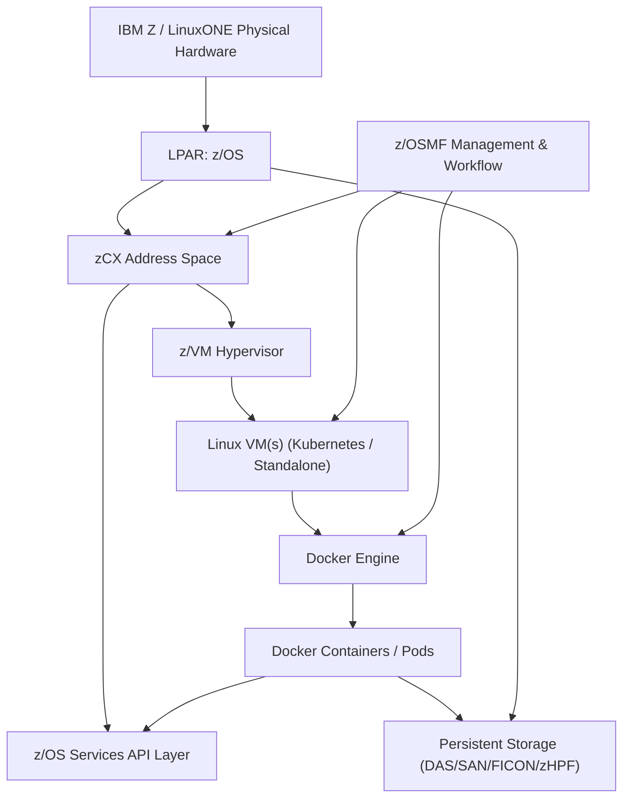
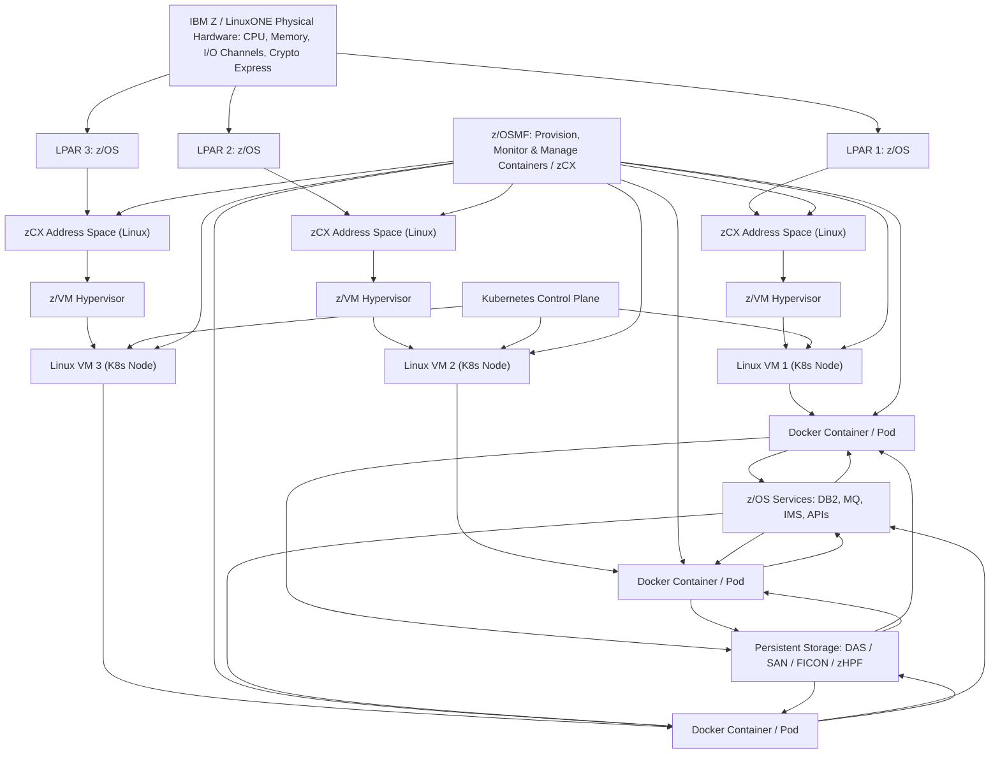
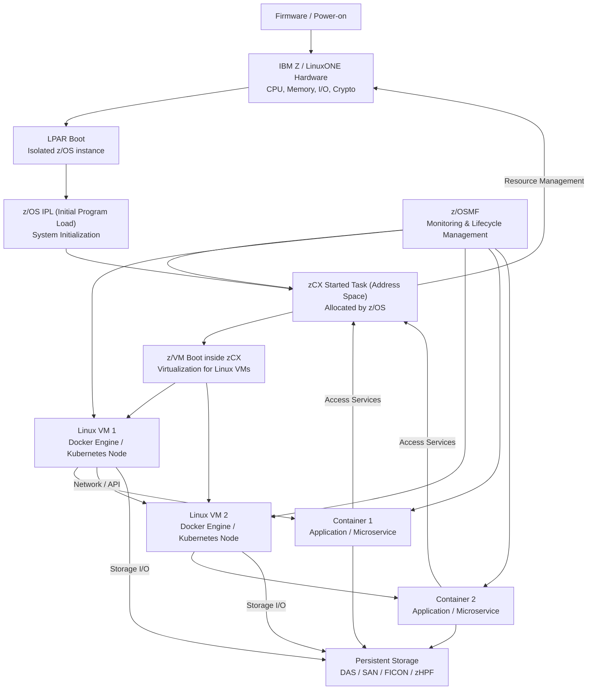

# Chapter 23: IBM zCX – Enabling Linux Containers on z/OS

IBM z/OS Container Extensions (zCX) is a feature introduced in z/OS 2.4 that enables the deployment of Linux applications as Docker containers within a z/OS environment. This integration allows for the co-location of Linux-based workloads with traditional z/OS applications, facilitating modern application architectures while leveraging the strengths of the mainframe.

---

## 23.1 What is IBM zCX?

IBM zCX provides an execution environment within z/OS that allows Linux applications to run as Docker containers. Each zCX instance operates within its own z/OS address space, providing isolation and resource management. This setup eliminates the need for separate Linux partitions, streamlining operations and reducing overhead.

**Key Features:**

- **Co-location of Workloads:** Run Linux containers alongside z/OS applications, enabling seamless integration.
- **Operational Control:** Maintain z/OS qualities of service, including scalability, availability, and security.
- **Resource Efficiency:** Utilize zIIP processors for eligible workloads, optimizing resource usage and cost.

---

## 23.2 Architecture Overview

The zCX architecture integrates Docker-compatible Linux containers into the z/OS environment. Each containerized application runs within a dedicated zCX address space, which is managed through z/OS Management Facility (z/OSMF). This design ensures that Linux applications can interact with z/OS resources while benefiting from the mainframe's robust infrastructure.

**Components:**

- **zCX Address Space:** Hosts the Linux environment and manages containerized applications.
- **z/OSMF Workflows:** Facilitate the provisioning, management, and monitoring of zCX instances.
- **Docker Engine:** Runs within the zCX address space, managing container lifecycles.

### 23.2.1 Workflow Diagram

#### Diagram Explanation

- **IBM Z / LinuxONE Physical Hardware:** CPU, memory, I/O channels, Crypto Express cards.

- **LPAR (Logical Partition):** Runs z/OS in an isolated partition.

- **zCX Address Space:** Hosts Linux VMs and Docker engine.

- **z/VM:** Provides virtualization for multiple Linux VMs.

- **Linux VMs:** Containers run inside these VMs, optionally orchestrated by Kubernetes.

- **Docker Engine:** Manages container lifecycle (deployment, scaling, networking).

- **Docker Containers / Pods:** Host Linux workloads or microservices.

- **z/OS Services API Layer:** Exposes mainframe services (DB2, MQ, etc.) to containers.

- **Persistent Storage:** Containers access DAS, SAN, FICON, or zHPF storage.

- **z/OSMF Management & Workflow:** Handles provisioning, lifecycle management, and monitoring for zCX, Linux VMs, and Docker containers.

This layout shows end-to-end integration from physical hardware, through z/OS and zCX, to Docker containers, while highlighting **z/OSMF’s role in managing the environment**.

---

### Multi-LPAR zCX with Kubernetes and z/OSMF

#### Explanation

- Multiple LPARs run isolated z/OS instances on the same physical IBM Z / LinuxONE hardware.

- Each LPAR hosts a **zCX address space**, running Linux for container workloads.

- **z/VM hypervisors** provide virtualization of Linux VMs, enabling multiple Kubernetes nodes per zCX.

- **Linux VMs** serve as Kubernetes worker nodes; the control plane can span multiple nodes for high availability (HA).

- **Docker containers (pods)** run business services or applications.

- Containers interact with **z/OS services** and persistent storage (DAS, SAN, FICON, zHPF).

- **z/OSMF** orchestrates provisioning, monitoring, and management across the entire stack.

- **High availability** is enabled through multi-node Kubernetes, multi-LPAR deployment, and redundant storage access.

This layout clearly shows multi-LPAR, multi-node orchestration, containerized workloads, and management with **z/OSMF**, making it closer to a real production IBM Z / LinuxONE zCX deployment.

## 23.3 Use Cases for zCX

IBM zCX supports various use cases that enhance the capabilities of z/OS environments:

- **IBM MQ Client Concentrator:** Deploying a lightweight client within a container to interact with z/OS-based MQ servers.
- **Service Management Unite:** Centralizing management interfaces for z/OS subsystems within a unified portal.
- **Application Modernization:** Running microservices, non-SQL databases, and analytics frameworks alongside traditional z/OS applications.
- **Open Source Integration:** Utilizing open-source tools and libraries within the z/OS ecosystem.

These use cases demonstrate how zCX can modernize mainframe operations by integrating contemporary application architectures.

## 23.4 Security and Compliance

zCX inherits the security features of z/OS, including:

- **RACF Integration:** Ensures secure access control for containerized applications.
- **Data Protection:** Leverages z/OS's data encryption and integrity mechanisms.
- **Compliance:** Meets regulatory requirements by maintaining data locality and auditability within the z/OS environment.

This robust security framework ensures that Linux containers running on zCX adhere to the same standards as traditional z/OS applications.

## 23.5 Performance and Resource Management

zCX is designed to optimize resource utilization:

- **zIIP Processor Utilization:** Eligible workloads can run on zIIP processors, reducing costs and improving performance.
- **Resource Allocation:** zCX instances are allocated CPU, memory, and storage resources through z/OSMF, ensuring efficient use of system resources.
- **Performance Monitoring:** Tools integrated with z/OS provide visibility into the performance of containerized applications.

These features enable efficient management of resources, ensuring that Linux containers operate effectively within the z/OS environment.

## 23.6 Getting Started with zCX

To begin using zCX:

1. **System Requirements:** Ensure your system meets the prerequisites, including z/OS 2.4 or higher and a supported IBM Z server.
2. **Installation:** Use z/OSMF to provision and configure zCX instances.
3. **Deployment:** Deploy Docker images within the zCX environment using standard Docker tools.
4. **Management:** Utilize z/OSMF workflows for ongoing management and monitoring of zCX instances.

IBM provides resources and support to assist with the setup and operation of zCX, ensuring a smooth integration process.

## 23.7  zCX Boot and Communication Overview
### 1. Firmware Boot (Processor Initialization)

**Power-On / Reset**  
- Mainframe processor initializes internal registers, caches, and microcode.  
- Performs Power-On Self-Test (POST).  

**System Firmware Execution**  
- IBM Z uses Processor Firmware (HMC / Service Processor firmware).  
- Initializes memory, I/O channels, and devices (FICON, Crypto Express, OSA adapters).  
- Loads the Initial Program Load (IPL) routine into processor memory.  
---
### 2. LPAR Initialization

**LPAR (Logical Partition) Activation**  
- Firmware partitions physical hardware into LPARs.  
- Each LPAR has assigned CPU, memory, and I/O channels.  
- LPARs are isolated and can run different OSs simultaneously.  

**LPAR IPL (Initial Program Load)**  
- Firmware starts the IPL for the assigned OS.  
- For zCX deployments, this is typically **z/OS**.  
---
### 3. z/OS Boot Process

**z/OS IPL**  
- Loads control blocks, kernel, and system address space.  
- Initializes standard started tasks and subsystems (DB2, CICS, USS).  

**System Initialization**  
- Memory management, job scheduler, I/O subsystem, and networking are brought online.  
- z/OS is ready to start application-level services.  
---
### 4. zCX Address Space Initialization

**zCX Started Task**  
- z/OS invokes zCX as a Started Task (STC).  
- Allocates an isolated address space inside z/OS with memory, CPU, and I/O access.  

**Resource Allocation**  
- Memory reserved for zCX and its VMs.  
- CPU slices scheduled via LPAR.  
- Virtualized I/O channels available to Linux VMs.  
---
### 5. z/VM Boot Inside zCX

**z/VM Initialization**  
- zCX uses z/OS virtualization services to start z/VM.  
- z/VM acts as hypervisor for Linux VMs.  
- System control blocks for z/VM loaded; virtual CPUs configured.  

**Virtual Device Assignment**  
- z/VM virtualizes storage (DAS, SAN, FICON) and network interfaces.  
- Linux VMs receive virtual CPUs, memory, and devices.  
---
### 6. Linux VM Boot

**Linux Kernel Initialization**  
- Each Linux VM boots s390x Linux kernel.  
- Detects virtual devices provided by z/VM (disks, network interfaces).  

**Init / Systemd Startup**  
- Standard init or systemd services start.  
- Docker Engine or Kubernetes agent is launched for container orchestration.  

**Container Deployment**  
- Docker containers or pods are started.  
- Containers can communicate with z/OS services (DB2, MQ) via network/API layer.  
---
### 7. Management & Monitoring

- z/OSMF monitors zCX, Linux VMs, and containers.  
- Administrators can start/stop/reconfigure Linux VMs dynamically.  
- High availability and scaling ensured through multi-LPAR deployment and Kubernetes orchestration.

  #

## Explanation

- **Firmware / Hardware** initializes the system.
- **LPAR boot** loads an isolated z/OS instance.
- **IPL** starts standard z/OS services.
- **zCX Started Task (STC)** is allocated for Linux workloads.
- **z/VM** boots inside the zCX address space to host Linux VMs.
- **Linux VMs** run Docker/Kubernetes workloads.
- **Containers** host applications, accessing storage and services.
- **z/OSMF** monitors and manages zCX, Linux VMs, and containers.
- **Communication flows:** Containers ↔ Linux VMs ↔ zCX ↔ z/OS services and storage.

## 23.7 Summary

IBM zCX bridges the gap between traditional z/OS applications and modern Linux-based workloads. By enabling the deployment of Docker containers within the z/OS environment, zCX allows organizations to modernize their application architectures while maintaining the reliability and security of the mainframe.

Whether integrating open-source tools, modernizing legacy applications, or deploying microservices, zCX provides a flexible and efficient platform for running Linux containers on z/OS.

## 23.8 Further Reading and Resources

- [IBM zCX Documentation](https://www.ibm.com/docs/en/zos/2.4.0?topic=extensions-what-is-zos-container)
- [IBM zCX Redbooks](https://www.redbooks.ibm.com/abstracts/sg248471.html)
- [IBM zCX Support](https://www.ibm.com/support/z-content-solutions/container-extensions/)
