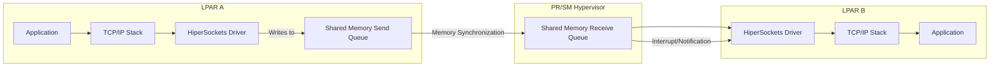
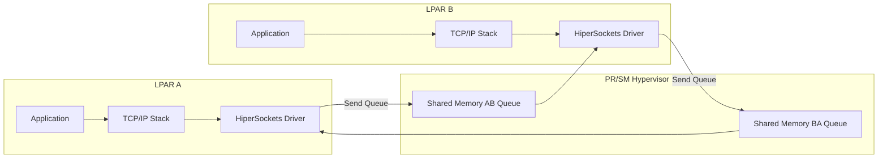
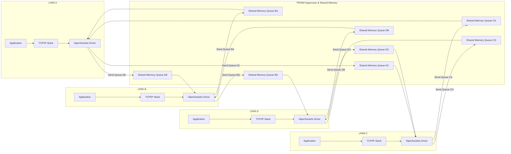

# Chapter 24: Communication Between LPARs

## 24.1 Introduction

Logical Partitions (LPARs) are independent virtual machines running on a single IBM mainframe system. While LPARs operate independently, many workloads require **high-speed, low-latency communication** between them. This chapter explores the mechanisms that enable inter-LPAR communication, focusing on **HiperSockets**, shared memory techniques, and other networking methods within the z/Architecture environment.

## 24.2 Overview of LPAR Communication

LPARs communicate using:

1. **HiperSockets** – Memory-only, high-speed TCP/IP communication.
2. **Channel-to-Channel (CTC) Adapters** – Emulated or physical I/O channels for data exchange.
3. **Shared Coupling Facility (CF) Structures** – For workload coordination and message passing.
4. **Traditional Networking** – Using standard Ethernet, OSA-Express, or other network adapters.

Among these, **HiperSockets** provides the fastest and most secure method because data never leaves the mainframe’s memory subsystem.

## 24.3 HiperSockets Architecture

### 24.3.1 Key Components

| Component | Description |
|-----------|-------------|
| **LPARs** | Independent virtual machines that need to communicate. |
| **Virtual NICs** | HiperSockets virtual network adapters configured per LPAR. |
| **PR/SM Hypervisor** | Manages memory sharing, isolation, and synchronization between LPARs. |
| **Shared Memory Buffers** | Memory areas used to transfer TCP/IP packets between LPARs. |

### 24.3.2 How HiperSockets Works

1. **Application Layer**: Applications send or receive data via **standard TCP/IP sockets**.  
2. **TCP/IP Stack**: TCP segments and IP packets are prepared for transport.  
3. **HiperSockets Driver**: Acts like a network adapter but uses **memory queues** instead of physical cabling.  
4. **Shared Memory Transfer**: Packets are written to a **send queue** in shared memory, visible to the destination LPAR.  
5. **Memory Synchronization**: PR/SM ensures cache coherency and access control.  
6. **Receiving LPAR Driver**: Reads packets from the **receive queue** and passes them to the TCP/IP stack.  
7. **Delivery to Application**: TCP/IP stack reassembles data and delivers it via socket API.

## 24.4 Internal Data Flow Example

Consider LPAR A sending data to LPAR B:

### Explanation

- LPAR A writes data to a **shared memory send queue** via its HiperSockets driver.
- Hypervisor **synchronizes memory**, making the data visible to LPAR B.
- LPAR B driver is **notified via an interrupt** and reads the data.
- Data flows through **TCP/IP stack** to the application.

This architecture enables **sub-microsecond latency** and high throughput, ideal for workload-intensive applications such as **databases, transaction processing, and high-speed file transfers**.

## 24.5 Advanced Features

### 24.5.1 Bidirectional Communication

- Each LPAR can have multiple **virtual NICs**.
- **Send and receive queues** are separate per NIC, supporting **simultaneous bidirectional traffic**.

---
### Data Flow Between 4 LPARs

### Explanation

- Each pair of LPARs has **dedicated shared memory queues** for bidirectional communication.  
- **HiperSockets drivers** handle sending and receiving data through these queues.  
- **Interrupts or notifications** signal when data is available for reading.  
- Applications interact **transparently via TCP/IP**, with no need for physical network devices.
---
### 24.5.2 Security

- Data **never leaves the mainframe**, reducing exposure to external threats.
- Virtual NICs can be **isolated per LPAR**, preventing unauthorized access.
---
### 24.5.3 Scalability

- HiperSockets scales with the **number of virtual NICs** and **mainframe memory bandwidth**.
- Multiple LPARs can communicate through the **same HiperSockets network** without additional physical infrastructure.

## 24.6 Comparison with Other Communication Methods

| Method             | Latency   | Throughput | Use Case                               |
|-------------------|-----------|------------|----------------------------------------|
| **HiperSockets**    | Ultra-low | Very high  | In-memory TCP/IP, high-speed apps      |
| **CTC Adapters**    | Medium    | Medium     | Legacy systems, SNA applications       |
| **Coupling Facility** | Low       | High       | DB2, workload coordination             |
| **Ethernet / OSA**  | Higher    | Medium     | External network communication         |

## 24.7 Best Practices

- **Use HiperSockets** wherever possible for internal LPAR communication.  
- **Configure dedicated virtual NICs** per workload to avoid congestion.  
- **Monitor shared memory usage** to prevent queue overflow.  
- **Leverage interrupts instead of polling** for efficient CPU usage.  
- **Ensure security isolation** between unrelated LPARs.  

---

## 24.8 Summary

LPAR-to-LPAR communication is a critical component of mainframe architecture. **HiperSockets** provides:

- **Memory-only, high-speed data transfer**  
- **Standard TCP/IP compatibility**  
- **Ultra-low latency and high throughput**  
- **Secure in-system communication**  
